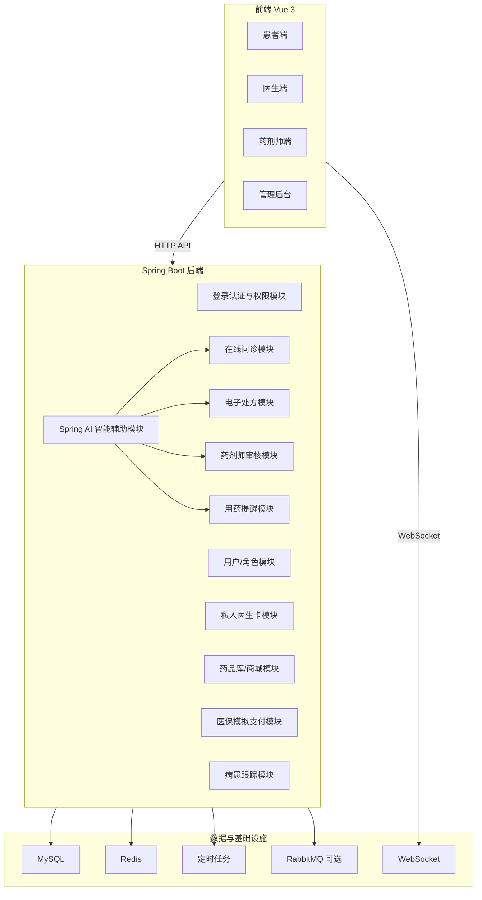

# 在线医疗健康平台 —— 项目概述与技术选型

> 项目名称：悦医健康（MedCare Online）  
> 文档版本：v1.1  
> 文档日期：2026-04-27  
> 项目性质：在线医疗业务模拟开发  
> 参考方向：京东健康、平安好医生、好大夫在线的在线问诊与私人医生服务模式

## 1. 项目背景

在线问诊正在成为医疗服务数字化的重要入口。患者希望在移动端快速找到可信医生，医生希望在线完成图文问诊、处方建议和长期病患管理，平台则需要把问诊、处方、药品、医保支付、提醒和追踪串成完整闭环。

本项目模拟“购买指定名医作为私人医生”的业务模式，患者可按次卡、月卡、季卡、半年卡、年卡购买指定医生服务，并在服务有效期或服务次数范围内进行一对一在线问诊。医生可根据问诊情况开具电子处方，药剂师审核处方和药物相互作用后，患者使用模拟医保卡在线购买药品，系统继续提供用药提醒与病患跟踪。

## 2. 建设目标

| 目标 | 说明 |
|------|------|
| 私人医生服务 | 支持患者购买指定医生服务卡，区分次卡、月卡、季卡、半年卡、年卡 |
| 在线问诊 | 支持一对一实时聊天、问诊时长控制、医生赠送时长、问诊记录沉淀 |
| 电子处方 | 支持医生开具处方，关联诊断、药品、剂量、用法和库存提醒 |
| 药剂师审核 | 支持药剂师检查处方合理性、药物相互作用、库存和用药建议 |
| 医保购药 | 支持模拟医保卡绑定、余额校验、医保支付和购药订单 |
| 药品库/商城 | 支持药品信息、库存、价格、处方药标识和搜索筛选 |
| 病患跟踪 | 支持随访计划、健康指标、症状记录、医生查看患者状态 |
| 用药提醒 | 支持按医嘱生成智能提醒，记录已服药、漏服和提醒状态 |
| AI 智能辅助 | 接入 Spring AI，提供问诊摘要、处方解释、药师审核提示和用药提醒文案 |

## 3. 项目边界

### 3.1 本项目实现内容

1. 面向患者、医生、药剂师、管理员四类角色的核心业务流程。
2. 模拟医保卡、药品库存、药物相互作用规则和通知提醒。
3. 使用 Vue 完成前端页面与交互，使用 Spring Boot 完成后端接口。
4. 以教学与课程项目为目标，保证业务闭环完整、模块划分清晰、文档可追溯。

### 3.2 本项目不实现内容

1. 不连接真实医院 HIS、医保局、支付机构或真实处方流转平台。
2. 不提供真实医学诊断能力，所有医疗数据仅用于模拟。
3. 不使用真实短信、真实支付、真实医保扣费。
4. 不引入 Spring Security；权限认证采用自定义 JWT、拦截器与 RBAC 方案。

## 4. 用户角色

| 角色 | 主要职责 |
|------|----------|
| 患者 | 注册登录、购买私人医生卡、发起问诊、查看处方、医保购药、记录健康状态、接收用药提醒 |
| 医生 | 管理个人服务卡、接诊聊天、赠送问诊时长、开具电子处方、查看病患跟踪记录 |
| 药剂师 | 审核处方、检查药物相互作用、维护药品库、处理库存预警、给出用药建议 |
| 管理员 | 管理用户、医生、药剂师、药品、订单、医保模拟数据和平台基础配置 |

## 5. 总体架构

项目建议采用“前后端分离 + 后端模块化单体”的架构。课程项目初期不直接拆微服务，避免复杂度过高；当模块稳定后，可按用户、问诊、处方、药品、订单、通知等边界逐步拆分。

## 6. 技术选型

### 6.1 前端技术栈

| 技术 | 建议版本 | 用途 | 选型理由 |
|------|----------|------|----------|
| Vue 3 | 3.x | 前端核心框架 | Composition API 适合复杂业务页面组织 |
| Vite | 5.x 或 6.x | 构建工具 | 启动快，适合前端课程项目开发 |
| TypeScript | 5.x | 类型约束 | 便于维护接口类型、角色权限和表单结构 |
| Vue Router | 4.x | 路由管理 | 支持多角色页面和路由守卫 |
| Pinia | 2.x/3.x | 状态管理 | 管理登录态、用户信息、聊天会话、购物车等状态 |
| Element Plus | 2.x | UI 组件库 | 表格、表单、弹窗、后台管理页面支持完善 |
| Axios | 1.x | HTTP 请求 | 统一封装 Token、错误处理和接口请求 |
| WebSocket Client | 原生或 STOMP | 实时通信 | 支持一对一聊天、处方审核消息、提醒推送 |
| ECharts | 5.x | 数据可视化 | 用于健康指标趋势、订单统计、库存趋势 |
| Day.js | 1.x | 时间处理 | 用于卡有效期、提醒时间、处方有效期 |

### 6.2 后端技术栈

| 技术 | 建议版本 | 用途 | 选型理由 |
|------|----------|------|----------|
| Spring Boot | 3.5.x | 后端主框架 | 当前项目已初始化，适合快速开发 REST API |
| Java | 21 | 后端语言 | LTS 版本，性能和语法体验较好 |
| Spring Web | 6.x | REST 接口 | 提供 Controller、拦截器、参数校验基础 |
| Spring Data JDBC | 当前已有 | 基础数据访问 | 当前项目已引入，可用于简单表映射 |
| MyBatis-Plus | 3.5.x | 复杂查询增强 | 处方审核、药品搜索、统计报表等复杂 SQL 更方便 |
| WebSocket | Spring WebSocket | 实时聊天 | 支持患者和医生一对一实时消息 |
| JWT | jjwt 或 java-jwt | 登录令牌 | 自定义登录认证，避免引入 Spring Security |
| Spring MVC Interceptor | Spring 内置 | 权限拦截 | 校验 Token、角色权限、接口访问范围 |
| Spring Validation | Jakarta Validation | 参数校验 | 保证表单、处方、药品、订单参数合法 |
| Spring Scheduling | Spring 内置 | 定时任务 | 用药提醒、卡过期处理、处方过期处理 |
| Quartz | 可选 | 高级调度 | 多频次复杂用药提醒可在后期引入 |
| Spring AI | 1.1.4（建议） | AI 智能辅助 | 使用 ChatClient、Advisor、RAG 接入大模型能力 |
| Ollama / OpenAI 兼容模型 | 可选 | 模型服务 | 本地演示可用 Ollama，在线部署可替换为外部模型服务 |

### 6.3 数据库、缓存与消息

| 技术 | 用途 |
|------|------|
| MySQL 8.0+ | 保存用户、医生、订单、处方、药品、医保卡、提醒等主数据 |
| Redis 7.x | 保存验证码、登录状态辅助信息、聊天剩余时长、热点药品缓存 |
| RabbitMQ | 可选，用于处方审核通知、库存预警、用药提醒异步分发 |
| Nginx | 前端静态资源托管、后端接口反向代理 |
| Docker Compose | 可选，用于统一 MySQL、Redis、RabbitMQ 本地环境 |
| Redis Vector Store / SimpleVectorStore | AI 知识检索可选，用于药品说明、用药规则、平台文档 RAG |

### 6.4 文档与接口工具

| 工具 | 用途 |
|------|------|
| Markdown | 编写项目需求、设计、阶段计划和验收文档 |
| Knife4j / Springdoc OpenAPI | 自动生成接口文档 |
| Apifox / Postman | 接口调试与接口用例管理 |
| Git | 版本控制 |

## 7. 认证与权限方案

本项目明确不使用 Spring Security。建议采用轻量自定义方案：

1. 登录成功后后端签发 JWT，前端保存到 Pinia 和本地存储。
2. 前端请求通过 Axios 请求拦截器携带 `Authorization: Bearer <token>`。
3. 后端通过 Spring MVC `HandlerInterceptor` 校验 Token、解析用户 ID、角色和有效期。
4. 使用自定义注解或权限表控制接口访问，例如患者、医生、药剂师、管理员。
5. WebSocket 握手阶段携带 Token，后端校验通过后才能加入聊天会话。
6. 敏感操作写入审计日志，包括处方开具、药剂师审核、医保支付和库存修改。

## 8. 模拟数据策略

| 数据类型 | 模拟方式 |
|----------|----------|
| 医保卡数据 | 本地表保存医保卡号、姓名、余额、状态、可报销比例 |
| 联网医疗数据 | 使用本地模拟接口返回医院、科室、疾病、药品、医保目录等数据 |
| 药物相互作用 | 建立规则表，维护药品 A、药品 B、风险等级、审核提示 |
| 药品库存 | 药品库维护库存数量，开处方和下单时进行库存预警 |
| AI 知识库 | 使用本地 Markdown、药品说明、药物规则和平台数据构建 RAG 语料 |
| 通知提醒 | 使用站内信、WebSocket 和浏览器通知模拟短信/APP 推送 |
| 支付流程 | 使用订单状态流转模拟医保扣费，不接入真实支付 |

## 9. 模块优先级概览

| 优先级 | 模块 | 原因 |
|--------|------|------|
| P0 | 用户角色、私人医生卡、在线问诊、电子处方、药剂师审核、药品库、医保购药 | 构成在线医疗核心闭环 |
| P1 | 病患跟踪、用药提醒、库存预警、医生赠送时长、审计日志、Spring AI 智能辅助 | 提升业务完整度和医疗场景可信度 |
| P2 | 数据看板、智能推荐、消息队列、复杂统计、移动端适配优化 | 属于增强体验和扩展能力 |

## 10. 文档清单

| 文档 | 说明 |
|------|------|
| [00_文档目录.md](./00_文档目录.md) | 项目文档导航 |
| [02_功能需求文档.md](./02_功能需求文档.md) | 详细功能需求、角色流程、非功能需求 |
| [03_模块设计与优先级.md](./03_模块设计与优先级.md) | 模块边界、依赖关系、开发优先级 |
| [04_阶段开发计划.md](./04_阶段开发计划.md) | 分阶段开发任务、交付物、验收标准 |
| [05_数据库与模拟数据设计.md](./05_数据库与模拟数据设计.md) | 核心表、关系、模拟数据规则 |
| [06_前端Vue设计方案.md](./06_前端Vue设计方案.md) | Vue 页面、路由、状态和组件规划 |
| [07_API接口规划.md](./07_API接口规划.md) | REST API 与 WebSocket 事件规划 |
| [08_测试与验收标准.md](./08_测试与验收标准.md) | 测试范围、关键用例和最终验收 |
| [09_SpringAI智能辅助功能设计.md](./09_SpringAI智能辅助功能设计.md) | Spring AI 接入、AI 场景、提示词、安全边界 |
