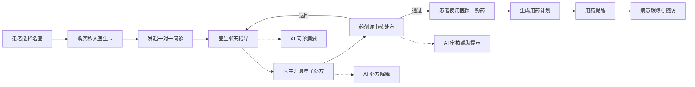

# 在线医疗健康平台 —— 功能需求文档

> 文档版本：v1.0  
> 文档日期：2026-04-27  
> 需求范围：患者端、医生端、药剂师端、管理后台

## 1. 业务总览

系统以患者购买指定名医私人医生服务为入口，以在线问诊和电子处方为核心，以药剂师审核、医保购药、病患跟踪和用药提醒为后续闭环。

## 2. 角色需求

| 角色 | 核心诉求 |
|------|----------|
| 患者 | 找到指定医生、购买服务卡、在线咨询、获取处方、医保购药、按时用药 |
| 医生 | 管理接诊服务、与患者聊天、控制问诊时长、开处方、跟踪患者情况 |
| 药剂师 | 审核处方安全性、维护药品库存、判断药物相互作用、给出用药建议 |
| 管理员 | 维护基础数据、审核医生药剂师账号、监管订单处方药品和系统运行 |

## 3. 功能模块需求

### 3.1 登录注册与角色权限

| 编号 | 需求 | 优先级 |
|------|------|--------|
| AUTH-01 | 支持患者、医生、药剂师、管理员登录 | P0 |
| AUTH-02 | 支持按角色进入不同首页和菜单 | P0 |
| AUTH-03 | 支持 JWT 登录态校验和退出登录 | P0 |
| AUTH-04 | 支持接口权限拦截，不同角色只能访问授权功能 | P0 |
| AUTH-05 | 支持账号禁用、密码修改、基础资料维护 | P1 |

说明：认证授权不使用 Spring Security，采用 JWT、Spring MVC 拦截器、自定义 RBAC 权限模型实现。

### 3.2 私人医生服务购买

| 编号 | 需求 | 优先级 |
|------|------|--------|
| CARD-01 | 患者可按科室、疾病、职称、评分搜索医生 | P0 |
| CARD-02 | 医生详情页展示头像、职称、医院、擅长、服务价格、评价 | P0 |
| CARD-03 | 支持次卡、月卡、季卡、半年卡、年卡 | P0 |
| CARD-04 | 不同卡型配置有效期、可问诊次数、单次聊天时长、总时长 | P0 |
| CARD-05 | 患者购买后生成服务订单和有效服务权益 | P0 |
| CARD-06 | 支持查看当前卡剩余次数、剩余时长、到期时间 | P0 |
| CARD-07 | 医生端可查看已购买自己的患者列表 | P1 |
| CARD-08 | 管理员可配置卡型价格和上下架状态 | P1 |

### 3.3 在线一对一问诊聊天

| 编号 | 需求 | 优先级 |
|------|------|--------|
| CHAT-01 | 患者只能向已购买服务且未过期的医生发起问诊 | P0 |
| CHAT-02 | 支持患者与医生一对一实时文字聊天 | P0 |
| CHAT-03 | 支持发送图片或检查报告附件 | P1 |
| CHAT-04 | 系统按卡型限制单次问诊时长或总时长 | P0 |
| CHAT-05 | 问诊剩余时长不足时提醒患者和医生 | P0 |
| CHAT-06 | 医生可向患者赠送额外问诊时长 | P1 |
| CHAT-07 | 聊天窗口支持查看患者基本病史、历史处方和健康跟踪记录 | P1 |
| CHAT-08 | 问诊结束后保存聊天记录和问诊摘要 | P0 |

### 3.4 电子处方

| 编号 | 需求 | 优先级 |
|------|------|--------|
| RX-01 | 医生可在问诊中为患者创建电子处方 | P0 |
| RX-02 | 处方需包含诊断、药品、规格、剂量、频次、疗程、用药说明 | P0 |
| RX-03 | 开方时系统提示药品库存是否充足 | P0 |
| RX-04 | 处方提交后进入“待药剂师审核”状态 | P0 |
| RX-05 | 医生可查看自己开具的处方状态 | P0 |
| RX-06 | 审核退回后医生可修改并重新提交 | P1 |
| RX-07 | 处方设置有效期，过期后不可购药 | P1 |

### 3.5 药剂师审核

| 编号 | 需求 | 优先级 |
|------|------|--------|
| PHARM-01 | 药剂师可查看待审核处方列表 | P0 |
| PHARM-02 | 系统自动检查处方药品库存 | P0 |
| PHARM-03 | 系统自动检查处方内药物相互作用 | P0 |
| PHARM-04 | 药剂师可通过、驳回或要求医生修改处方 | P0 |
| PHARM-05 | 药剂师可填写审核意见、用药建议、剂量建议 | P0 |
| PHARM-06 | 审核结果通过站内信或 WebSocket 通知患者和医生 | P1 |
| PHARM-07 | 审核行为写入审计日志 | P1 |

### 3.6 医保卡购药

| 编号 | 需求 | 优先级 |
|------|------|--------|
| INS-01 | 患者可绑定模拟医保卡 | P0 |
| INS-02 | 医保卡包含卡号、姓名、余额、状态、报销比例 | P0 |
| INS-03 | 审核通过的处方可生成购药订单 | P0 |
| INS-04 | 下单时校验处方有效期、药品库存、医保卡余额 | P0 |
| INS-05 | 支持医保卡支付并扣减模拟余额 | P0 |
| INS-06 | 支付成功后扣减药品库存 | P0 |
| INS-07 | 支持查看医保支付记录和购药订单详情 | P1 |

### 3.7 药品库与商城

| 编号 | 需求 | 优先级 |
|------|------|--------|
| DRUG-01 | 支持药品基础信息维护：名称、通用名、规格、厂家、价格 | P0 |
| DRUG-02 | 支持库存数量、库存预警阈值、上下架状态维护 | P0 |
| DRUG-03 | 标识处方药、非处方药、医保目录药品 | P0 |
| DRUG-04 | 患者可浏览药品商城，但处方药必须凭审核通过处方购买 | P1 |
| DRUG-05 | 药剂师可维护药物相互作用规则 | P1 |
| DRUG-06 | 管理员可查看库存预警列表 | P1 |

### 3.8 病患跟踪

| 编号 | 需求 | 优先级 |
|------|------|--------|
| TRACK-01 | 患者可填写症状变化、体温、血压、血糖等健康指标 | P1 |
| TRACK-02 | 医生可查看购买自己服务患者的跟踪记录 | P1 |
| TRACK-03 | 医生可创建随访计划和随访备注 | P1 |
| TRACK-04 | 系统可按时间展示健康指标趋势图 | P2 |
| TRACK-05 | 异常指标可触发站内提醒 | P2 |

### 3.9 用药提醒

| 编号 | 需求 | 优先级 |
|------|------|--------|
| REMIND-01 | 处方审核通过并购药后生成用药计划 | P1 |
| REMIND-02 | 支持按每日次数、具体时间、疗程天数设置提醒 | P1 |
| REMIND-03 | 系统按提醒时间生成站内通知 | P1 |
| REMIND-04 | 患者可标记已服药、稍后提醒、漏服 | P1 |
| REMIND-05 | 医生可查看患者用药执行情况 | P2 |

### 3.10 管理后台

| 编号 | 需求 | 优先级 |
|------|------|--------|
| ADMIN-01 | 管理医生、药剂师、患者账号 | P1 |
| ADMIN-02 | 管理医生服务卡配置 | P1 |
| ADMIN-03 | 管理药品、库存、医保目录模拟数据 | P1 |
| ADMIN-04 | 查看订单、处方、审核和支付记录 | P1 |
| ADMIN-05 | 查看平台统计报表 | P2 |

### 3.11 Spring AI 智能辅助

| 编号 | 需求 | 优先级 |
|------|------|--------|
| AI-01 | 医生端可基于聊天记录生成问诊摘要草稿 | P1 |
| AI-02 | 医生开方时可调用 AI 生成通俗版处方说明，供医生确认后展示给患者 | P1 |
| AI-03 | 药剂师审核时可调用 AI 汇总药品风险、用药注意事项和审核建议 | P1 |
| AI-04 | 患者端可查看 AI 生成的用药提醒文案和注意事项，但必须标注“仅供参考” | P1 |
| AI-05 | 系统可基于本地药品说明、药物相互作用规则、平台文档进行 RAG 检索增强 | P2 |
| AI-06 | AI 调用记录、输入摘要、输出结果和确认人需保存审计记录 | P1 |

AI 使用边界：

1. AI 仅提供辅助摘要和建议，不自动开具处方。
2. AI 不直接审核通过处方，最终结果必须由药剂师确认。
3. AI 输出给患者前应由医生或药剂师确认，或明确展示风险提示。
4. 敏感个人信息在进入 AI 请求前应尽量脱敏或最小化传输。

## 4. 核心业务规则

### 4.1 私人医生卡规则

| 卡型 | 有效期 | 建议权益 |
|------|--------|----------|
| 次卡 | 7 天 | 1 次问诊，单次 30 分钟 |
| 月卡 | 30 天 | 4 次问诊，总时长 180 分钟 |
| 季卡 | 90 天 | 12 次问诊，总时长 600 分钟 |
| 半年卡 | 180 天 | 24 次问诊，总时长 1200 分钟 |
| 年卡 | 365 天 | 52 次问诊，总时长 3000 分钟 |

医生可在问诊过程中赠送时长，赠送记录需写入系统，且不能超过平台配置的上限。

### 4.2 处方状态

| 状态 | 说明 |
|------|------|
| DRAFT | 草稿，医生尚未提交 |
| PENDING_AUDIT | 待药剂师审核 |
| APPROVED | 审核通过，可购药 |
| REJECTED | 审核驳回，不可购药 |
| NEED_MODIFY | 需医生修改 |
| PAID | 已医保支付 |
| EXPIRED | 已过期 |

### 4.3 订单状态

| 状态 | 说明 |
|------|------|
| UNPAID | 待支付 |
| PAID | 已支付 |
| CANCELED | 已取消 |
| REFUNDED | 已退款 |
| COMPLETED | 已完成 |

## 5. 非功能需求

| 类型 | 需求 |
|------|------|
| 易用性 | 页面流程应清晰，患者能在 3 步内完成选医生和购卡 |
| 性能 | 常规列表查询响应建议小于 1 秒，聊天消息推送尽量实时 |
| 安全 | Token 过期控制、角色权限校验、敏感数据脱敏、审计日志 |
| 可靠性 | 支付、库存、处方审核等状态变更需保证数据一致 |
| 可维护性 | 前后端按模块组织，接口命名统一，文档与代码同步 |
| 可扩展性 | 后续可扩展视频问诊、真实支付、真实医保接口、AI 辅助审核 |
| AI 安全 | AI 输出必须标记辅助性质，关键医疗决策必须人工确认 |

## 6. 验收主流程

1. 患者注册登录，选择医生并购买月卡。
2. 患者使用月卡发起一对一问诊。
3. 医生与患者聊天，赠送 10 分钟问诊时长。
4. 医生开具包含多种药品的电子处方。
5. 医生调用 AI 生成问诊摘要和处方说明草稿。
6. 系统提示库存与药物相互作用风险。
7. 药剂师结合 AI 审核辅助提示完成处方审核。
8. 患者绑定模拟医保卡并完成购药。
9. 系统生成用药提醒和病患跟踪记录。
