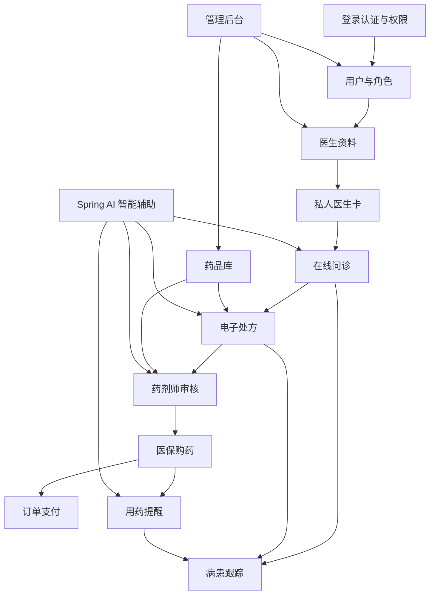

# 在线医疗健康平台 —— 模块设计与优先级

> 文档版本：v1.0  
> 文档日期：2026-04-27

## 1. 模块划分原则

1. 先保证核心业务闭环完整，再补充统计、推荐和体验优化。
2. 以后端业务边界拆模块，前端按角色和业务流程组织页面。
3. 医疗、医保、支付、短信等外部系统全部使用本地模拟数据。
4. 权限认证不使用 Spring Security，统一由自定义登录认证模块提供能力。

## 2. 总体模块依赖

## 3. 优先级定义

| 优先级 | 含义 | 开发策略 |
|--------|------|----------|
| P0 | 必须完成 | 没有该模块无法形成核心业务闭环 |
| P1 | 重要增强 | 能显著提升业务真实性和系统完整度 |
| P2 | 可选优化 | 时间充足时完成，用于展示亮点和扩展能力 |

## 4. 模块清单

| 模块 | 优先级 | 主要使用角色 | 依赖模块 | 说明 |
|------|--------|--------------|----------|------|
| 登录认证与权限 | P0 | 全部 | 无 | 登录、JWT、角色菜单、接口拦截 |
| 用户与角色 | P0 | 管理员 | 登录认证 | 患者、医生、药剂师、管理员基础资料 |
| 医生资料 | P0 | 患者、医生、管理员 | 用户与角色 | 名医资料、擅长方向、职称、价格、评分 |
| 私人医生卡 | P0 | 患者、医生、管理员 | 医生资料、订单 | 次卡/月卡/季卡/半年卡/年卡购买与权益 |
| 在线问诊 | P0 | 患者、医生 | 私人医生卡 | 一对一聊天、时长约束、赠送时长 |
| 电子处方 | P0 | 医生、患者 | 在线问诊、药品库 | 开处方、诊断、剂量、库存提示 |
| 药品库 | P0 | 患者、药剂师、管理员 | 无 | 药品、价格、规格、库存、医保目录 |
| 药剂师审核 | P0 | 药剂师、医生、患者 | 电子处方、药品库 | 审核、相互作用检查、用药建议 |
| 医保购药 | P0 | 患者 | 审核处方、药品库 | 模拟医保卡支付和购药订单 |
| 病患跟踪 | P1 | 患者、医生 | 问诊、处方 | 症状、指标、随访计划 |
| 用药提醒 | P1 | 患者、医生 | 处方、订单 | 提醒计划、已服药/漏服记录 |
| Spring AI 智能辅助 | P1 | 患者、医生、药剂师 | 问诊、处方、药品库 | 问诊摘要、处方解释、审核建议、提醒文案 |
| 管理后台 | P1 | 管理员 | 全部 | 基础数据管理、审核监管、报表入口 |
| 统计看板 | P2 | 管理员、医生 | 订单、处方、跟踪 | 平台数据统计、趋势图 |
| 智能推荐 | P2 | 患者 | 药品、医生、问诊 | 医生推荐、药品推荐、异常提醒 |

## 5. 模块详细描述

### 5.1 登录认证与权限模块

模块职责：

1. 用户登录、退出登录、Token 签发与校验。
2. 根据角色返回可访问菜单、按钮和接口权限。
3. WebSocket 握手时校验用户身份。
4. 将用户 ID、角色、姓名等信息放入请求上下文。

核心页面：

| 页面 | 说明 |
|------|------|
| 登录页 | 支持账号密码登录 |
| 个人中心 | 查看和修改基础资料 |
| 无权限页 | 无角色权限时提示 |

核心数据：

| 数据 | 说明 |
|------|------|
| 用户表 | 账号、密码、手机号、状态 |
| 角色表 | 患者、医生、药剂师、管理员 |
| 权限表 | 菜单权限和接口权限 |

### 5.2 私人医生卡模块

模块职责：

1. 展示医生列表和医生详情。
2. 管理医生服务卡配置。
3. 患者购买指定医生服务卡。
4. 计算有效期、剩余次数、剩余时长。
5. 为在线问诊提供权益校验。

卡型建议：

| 卡型 | 使用场景 | 关键限制 |
|------|----------|----------|
| 次卡 | 偶发咨询 | 1 次问诊，有短有效期 |
| 月卡 | 短期复诊 | 月内多次问诊 |
| 季卡 | 慢病观察 | 多次问诊和较长总时长 |
| 半年卡 | 长周期管理 | 适合稳定慢病管理 |
| 年卡 | 长期私人医生 | 适合家庭医生式服务 |

### 5.3 在线问诊模块

模块职责：

1. 创建患者和医生的一对一问诊会话。
2. 支持实时聊天、历史消息加载、消息已读状态。
3. 根据卡型扣减次数和时长。
4. 支持医生赠送额外聊天时长。
5. 支持从聊天窗口进入开处方页面。

关键规则：

| 规则 | 说明 |
|------|------|
| 发起校验 | 只有购买且未过期的服务卡才能发起问诊 |
| 时长校验 | 聊天时长达到限制后自动提醒并限制继续问诊 |
| 赠送时长 | 医生可赠送，但需记录赠送人、原因、分钟数 |
| 消息留痕 | 聊天消息和问诊摘要应可追溯 |

### 5.4 电子处方模块

模块职责：

1. 医生根据问诊创建处方。
2. 维护诊断、药品、剂量、频次、疗程、用药说明。
3. 开方时检查库存是否低于处方需求。
4. 提交后进入药剂师审核。

处方与药品关系：

| 内容 | 说明 |
|------|------|
| 处方主表 | 患者、医生、问诊、诊断、状态、有效期 |
| 处方明细 | 药品、规格、数量、单次剂量、每日频次、疗程 |
| 状态记录 | 草稿、待审、通过、驳回、需修改、已支付、过期 |

### 5.5 药剂师审核模块

模块职责：

1. 查看待审核处方。
2. 自动读取处方药品并匹配药物相互作用规则。
3. 检查库存、处方药属性、医保目录属性。
4. 给出通过、驳回或修改建议。
5. 形成处方审核记录。

审核重点：

| 检查项 | 说明 |
|--------|------|
| 药物相互作用 | 判断处方中多种药物是否存在禁忌或风险 |
| 剂量合理性 | 判断剂量是否超过预设范围 |
| 库存 | 库存不足时提示无法购药或建议替代 |
| 医保属性 | 标记是否可使用医保支付 |

### 5.6 医保购药模块

模块职责：

1. 绑定模拟医保卡。
2. 根据审核通过处方生成购药订单。
3. 校验医保卡余额、处方有效期和药品库存。
4. 模拟医保支付，扣减医保余额和库存。
5. 生成支付记录和订单记录。

支付规则：

| 规则 | 说明 |
|------|------|
| 处方限制 | 处方药必须关联审核通过且未过期处方 |
| 余额限制 | 医保卡余额不足则支付失败 |
| 库存限制 | 任一药品库存不足则订单不可支付 |
| 状态一致性 | 支付成功后订单、处方、库存、医保记录同步更新 |

### 5.7 病患跟踪模块

模块职责：

1. 患者记录症状、体征和用药反馈。
2. 医生查看患者长期变化。
3. 医生设置随访计划。
4. 系统生成趋势图和异常提醒。

跟踪内容：

| 类型 | 示例 |
|------|------|
| 症状记录 | 咳嗽、头痛、失眠、疼痛程度 |
| 生命体征 | 体温、血压、心率、血糖 |
| 用药反馈 | 是否服药、不良反应、疗效感受 |
| 随访计划 | 下次复诊时间、复查项目、注意事项 |

### 5.8 用药提醒模块

模块职责：

1. 根据处方和购药订单生成用药计划。
2. 支持每日多次提醒。
3. 到点生成站内通知或浏览器通知。
4. 记录患者已服药、漏服、稍后提醒。

提醒维度：

| 维度 | 说明 |
|------|------|
| 时间 | 早中晚、固定时间点 |
| 药品 | 每种药品独立提醒 |
| 疗程 | 根据处方疗程自动停止 |
| 反馈 | 已服药、漏服、稍后提醒 |

### 5.9 Spring AI 智能辅助模块

模块职责：

1. 根据问诊聊天记录生成问诊摘要草稿。
2. 根据处方药品和用法生成患者可理解的用药说明草稿。
3. 根据药品库、相互作用规则和处方内容生成药剂师审核辅助提示。
4. 根据用药计划生成自然语言提醒文案。
5. 保存 AI 输入摘要、输出结果、确认人和使用场景。

AI 场景：

| 场景 | 使用角色 | 输出内容 | 人工确认 |
|------|----------|----------|----------|
| 问诊摘要 | 医生 | 主诉、现病史、初步建议摘要 | 需要医生确认 |
| 处方解释 | 医生、患者 | 药品作用、用法、注意事项 | 需要医生确认 |
| 审核辅助 | 药剂师 | 相互作用提示、剂量风险、审核建议 | 需要药剂师确认 |
| 用药提醒 | 患者 | 更容易理解的提醒文案 | 可直接展示但需标注辅助 |
| 健康跟踪解读 | 医生、患者 | 指标变化解释和复诊建议 | 异常建议需医生确认 |

## 6. 开发优先级建议

第一优先完成：

1. 用户登录与角色菜单。
2. 医生列表、医生详情、卡型购买。
3. 在线问诊聊天和时长限制。
4. 医生开处方。
5. 药剂师审核处方。
6. 医保卡支付购药。

第二优先完成：

1. 药物相互作用规则维护。
2. 医生赠送问诊时长。
3. 库存预警。
4. 病患跟踪。
5. 用药提醒。
6. Spring AI 问诊摘要、处方解释和药师审核辅助。

第三优先完成：

1. 数据统计看板。
2. 复杂搜索筛选。
3. 移动端适配优化。
4. 消息队列异步通知。
