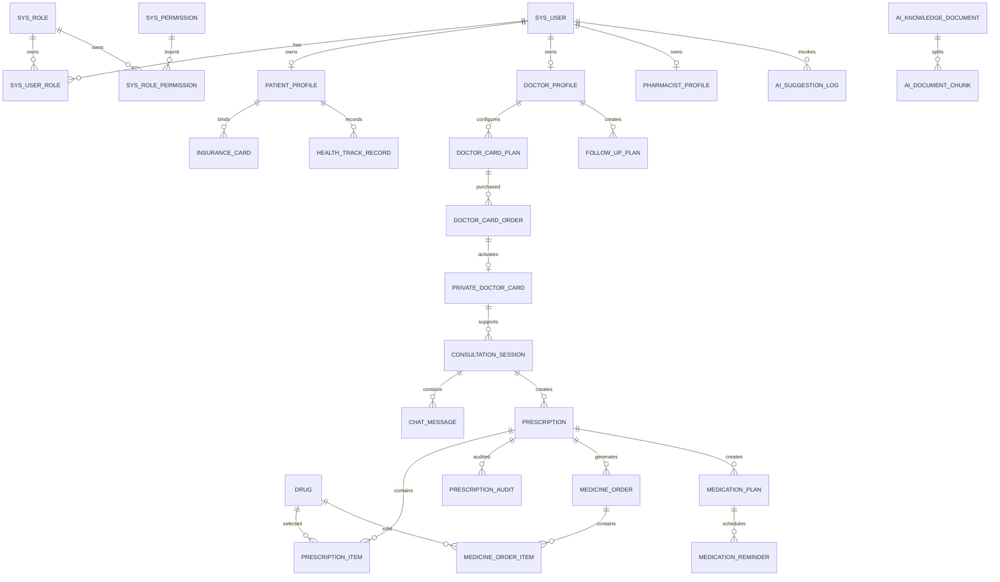

# 在线医疗健康平台 —— 完整数据库设计

> 文档版本：v2.0  
> 文档日期：2026-04-29  
> 数据库建议：MySQL 8.0+  
> 字符集建议：`utf8mb4`  
> 存储引擎建议：`InnoDB`

## 1. 设计结论

本项目建议统一使用 `create_time`、`update_time`，不使用 `created_at`、`updated_at`。

原因：

1. 当前项目是 Java + Spring Boot + MySQL，国内后台项目更常见 `create_time`、`update_time`。
2. Java 实体字段可自然映射为 `createTime`、`updateTime`。
3. 如果后续使用 MyBatis-Plus，自动填充字段也更常用 `createTime`、`updateTime`。
4. 全项目统一比字段名称本身更重要，避免同时出现 `created_at` 和 `create_time`。

## 2. 命名规范

| 类型 | 规范 | 示例 |
|------|------|------|
| 表名 | 小写下划线，按业务模块命名 | `sys_user`、`prescription_item` |
| 字段名 | 小写下划线 | `user_id`、`create_time` |
| 主键 | 统一使用 `id` | `id bigint` |
| 外键字段 | 业务名 + `_id` | `patient_id`、`doctor_id` |
| 状态字段 | 使用 `status` 或具体状态名 | `status`、`audit_result` |
| 金额字段 | 使用 `decimal(10,2)` | `price`、`total_amount` |
| 时间字段 | 使用 `datetime` | `create_time`、`paid_time` |
| 是否字段 | 使用 `tinyint`，0 否 1 是 | `deleted`、`insurance_covered` |

## 3. 通用字段

除纯中间表或特殊日志表外，所有业务表建议统一包含以下字段：

| 字段 | 类型 | 必填 | 默认值 | 说明 |
|------|------|------|--------|------|
| id | bigint | 是 | 自增或雪花 ID | 主键 |
| create_time | datetime | 是 | 当前时间 | 创建时间 |
| update_time | datetime | 是 | 当前时间 | 更新时间 |
| create_by | bigint | 否 | null | 创建人用户 ID |
| update_by | bigint | 否 | null | 更新人用户 ID |
| deleted | tinyint | 是 | 0 | 逻辑删除，0 未删，1 已删 |
| remark | varchar(500) | 否 | null | 备注 |

推荐 MySQL 默认写法：

```sql
create_time datetime not null default current_timestamp,
update_time datetime not null default current_timestamp on update current_timestamp,
deleted tinyint not null default 0
```

## 4. 核心实体关系



## 5. 系统权限模块

### 5.1 `sys_user` 用户表

| 字段 | 类型 | 约束 | 说明 |
|------|------|------|------|
| id | bigint | PK | 用户 ID |
| username | varchar(50) | uk | 登录账号 |
| password_hash | varchar(255) | not null | 密码哈希 |
| real_name | varchar(50) | not null | 真实姓名 |
| phone | varchar(20) | uk | 手机号 |
| email | varchar(100) | null | 邮箱 |
| avatar_url | varchar(500) | null | 头像地址 |
| gender | varchar(20) | null | 性别 |
| status | tinyint | default 1 | 0 禁用，1 正常 |
| last_login_time | datetime | null | 最近登录时间 |
| create_time/update_time/deleted | 通用字段 |  | 通用审计字段 |

索引建议：

| 索引 | 字段 |
|------|------|
| uk_username | username |
| uk_phone | phone |
| idx_status | status |

### 5.2 `sys_role` 角色表

| 字段 | 类型 | 约束 | 说明 |
|------|------|------|------|
| id | bigint | PK | 角色 ID |
| role_code | varchar(50) | uk | `PATIENT`、`DOCTOR`、`PHARMACIST`、`ADMIN` |
| role_name | varchar(50) | not null | 角色名称 |
| status | tinyint | default 1 | 0 禁用，1 启用 |
| create_time/update_time/deleted | 通用字段 |  | 通用审计字段 |

### 5.3 `sys_permission` 权限表

| 字段 | 类型 | 约束 | 说明 |
|------|------|------|------|
| id | bigint | PK | 权限 ID |
| permission_code | varchar(100) | uk | 权限编码，如 `prescription:audit` |
| permission_name | varchar(100) | not null | 权限名称 |
| permission_type | varchar(20) | not null | `MENU`、`BUTTON`、`API` |
| parent_id | bigint | default 0 | 父级权限 ID |
| path | varchar(255) | null | 前端路由或接口路径 |
| component | varchar(255) | null | 前端组件路径 |
| sort_no | int | default 0 | 排序 |
| status | tinyint | default 1 | 0 禁用，1 启用 |
| create_time/update_time/deleted | 通用字段 |  | 通用审计字段 |

### 5.4 `sys_user_role` 用户角色表

| 字段 | 类型 | 约束 | 说明 |
|------|------|------|------|
| id | bigint | PK | 主键 |
| user_id | bigint | idx | 用户 ID |
| role_id | bigint | idx | 角色 ID |
| create_time | datetime | not null | 创建时间 |

索引建议：`uk_user_role(user_id, role_id)`。

### 5.5 `sys_role_permission` 角色权限表

| 字段 | 类型 | 约束 | 说明 |
|------|------|------|------|
| id | bigint | PK | 主键 |
| role_id | bigint | idx | 角色 ID |
| permission_id | bigint | idx | 权限 ID |
| create_time | datetime | not null | 创建时间 |

索引建议：`uk_role_permission(role_id, permission_id)`。

### 5.6 `sys_audit_log` 操作审计日志表

| 字段 | 类型 | 约束 | 说明 |
|------|------|------|------|
| id | bigint | PK | 日志 ID |
| user_id | bigint | idx | 操作人用户 ID |
| username | varchar(50) | null | 操作人账号快照 |
| module | varchar(50) | idx | 模块，如 `PRESCRIPTION` |
| action | varchar(50) | idx | 操作，如 `SUBMIT`、`AUDIT`、`PAY` |
| target_id | bigint | idx | 目标业务 ID |
| target_type | varchar(50) | null | 目标类型 |
| content | text | null | 操作内容 |
| ip | varchar(64) | null | IP 地址 |
| user_agent | varchar(500) | null | 浏览器信息 |
| create_time | datetime | not null | 操作时间 |

## 6. 基础资料模块

### 6.1 `patient_profile` 患者资料表

| 字段 | 类型 | 约束 | 说明 |
|------|------|------|------|
| id | bigint | PK | 患者资料 ID |
| user_id | bigint | uk | 用户 ID |
| id_card_no | varchar(32) | null | 身份证号，展示时脱敏 |
| birthday | date | null | 出生日期 |
| height_cm | decimal(5,2) | null | 身高 |
| weight_kg | decimal(5,2) | null | 体重 |
| allergy_history | text | null | 过敏史 |
| medical_history | text | null | 既往病史 |
| family_history | text | null | 家族病史 |
| emergency_contact | varchar(50) | null | 紧急联系人 |
| emergency_phone | varchar(20) | null | 紧急联系电话 |
| create_time/update_time/deleted | 通用字段 |  | 通用审计字段 |

### 6.2 `doctor_profile` 医生资料表

| 字段 | 类型 | 约束 | 说明 |
|------|------|------|------|
| id | bigint | PK | 医生资料 ID |
| user_id | bigint | uk | 用户 ID |
| hospital | varchar(100) | not null | 所属医院 |
| department | varchar(100) | not null | 科室 |
| title | varchar(50) | not null | 职称 |
| license_no | varchar(100) | null | 执业证书号 |
| specialty | text | null | 擅长方向 |
| introduction | text | null | 个人简介 |
| consultation_count | int | default 0 | 接诊数量 |
| score | decimal(3,2) | default 5.00 | 评分 |
| service_status | tinyint | default 1 | 0 停诊，1 开放服务 |
| audit_status | varchar(30) | default `APPROVED` | 入驻审核状态 |
| create_time/update_time/deleted | 通用字段 |  | 通用审计字段 |

索引建议：`idx_department(department)`、`idx_service_status(service_status)`。

### 6.3 `pharmacist_profile` 药剂师资料表

| 字段 | 类型 | 约束 | 说明 |
|------|------|------|------|
| id | bigint | PK | 药剂师资料 ID |
| user_id | bigint | uk | 用户 ID |
| certificate_no | varchar(100) | not null | 执业证书号 |
| hospital_or_org | varchar(100) | null | 所属机构 |
| working_years | int | default 0 | 从业年限 |
| audit_status | varchar(30) | default `APPROVED` | 审核状态 |
| status | tinyint | default 1 | 0 停用，1 正常 |
| create_time/update_time/deleted | 通用字段 |  | 通用审计字段 |

### 6.4 `sys_dict_type` 字典类型表

| 字段 | 类型 | 约束 | 说明 |
|------|------|------|------|
| id | bigint | PK | 字典类型 ID |
| dict_code | varchar(50) | uk | 字典编码，如 `department` |
| dict_name | varchar(100) | not null | 字典名称 |
| status | tinyint | default 1 | 状态 |
| create_time/update_time/deleted | 通用字段 |  | 通用审计字段 |

### 6.5 `sys_dict_item` 字典项表

| 字段 | 类型 | 约束 | 说明 |
|------|------|------|------|
| id | bigint | PK | 字典项 ID |
| dict_type_id | bigint | idx | 字典类型 ID |
| item_label | varchar(100) | not null | 展示名称 |
| item_value | varchar(100) | not null | 字典值 |
| sort_no | int | default 0 | 排序 |
| status | tinyint | default 1 | 状态 |
| create_time/update_time/deleted | 通用字段 |  | 通用审计字段 |

## 7. 私人医生卡与订单模块

### 7.1 `doctor_card_plan` 医生服务卡配置表

| 字段 | 类型 | 约束 | 说明 |
|------|------|------|------|
| id | bigint | PK | 卡型配置 ID |
| doctor_id | bigint | idx | 医生 ID |
| card_type | varchar(30) | not null | `ONCE`、`MONTH`、`QUARTER`、`HALF_YEAR`、`YEAR` |
| plan_name | varchar(100) | not null | 卡名称 |
| price | decimal(10,2) | not null | 售价 |
| valid_days | int | not null | 有效天数 |
| consultation_times | int | not null | 可问诊次数 |
| total_minutes | int | not null | 总聊天时长 |
| single_minutes | int | not null | 单次聊天时长上限 |
| gift_limit_minutes | int | default 0 | 医生可赠送时长上限 |
| description | varchar(500) | null | 服务说明 |
| status | tinyint | default 1 | 0 下架，1 上架 |
| create_time/update_time/deleted | 通用字段 |  | 通用审计字段 |

索引建议：`idx_doctor_card_type(doctor_id, card_type)`。

### 7.2 `doctor_card_order` 私人医生卡购买订单表

| 字段 | 类型 | 约束 | 说明 |
|------|------|------|------|
| id | bigint | PK | 订单 ID |
| order_no | varchar(64) | uk | 订单编号 |
| patient_id | bigint | idx | 患者 ID |
| doctor_id | bigint | idx | 医生 ID |
| plan_id | bigint | idx | 服务卡配置 ID |
| card_type | varchar(30) | not null | 卡型快照 |
| plan_name | varchar(100) | not null | 卡名称快照 |
| total_amount | decimal(10,2) | not null | 应付金额 |
| pay_amount | decimal(10,2) | not null | 实付金额 |
| pay_type | varchar(30) | default `MOCK` | 支付方式，模拟支付 |
| status | varchar(30) | default `UNPAID` | `UNPAID`、`PAID`、`CANCELED`、`REFUNDED` |
| pay_time | datetime | null | 支付时间 |
| cancel_time | datetime | null | 取消时间 |
| create_time/update_time/deleted | 通用字段 |  | 通用审计字段 |

### 7.3 `private_doctor_card` 患者私人医生卡表

| 字段 | 类型 | 约束 | 说明 |
|------|------|------|------|
| id | bigint | PK | 服务卡 ID |
| patient_id | bigint | idx | 患者 ID |
| doctor_id | bigint | idx | 医生 ID |
| plan_id | bigint | idx | 卡型配置 ID |
| order_id | bigint | uk | 购买订单 ID |
| card_type | varchar(30) | not null | 卡型 |
| start_time | datetime | not null | 生效时间 |
| expire_time | datetime | not null | 到期时间 |
| total_times | int | not null | 总问诊次数 |
| remaining_times | int | not null | 剩余问诊次数 |
| total_minutes | int | not null | 总分钟数 |
| remaining_minutes | int | not null | 剩余分钟数 |
| gifted_minutes | int | default 0 | 已赠送分钟数 |
| status | varchar(30) | default `ACTIVE` | `ACTIVE`、`EXPIRED`、`USED_UP`、`REFUNDED` |
| create_time/update_time/deleted | 通用字段 |  | 通用审计字段 |

索引建议：`idx_patient_status(patient_id, status)`、`idx_doctor_patient(doctor_id, patient_id)`。

## 8. 在线问诊与聊天模块

### 8.1 `consultation_session` 问诊会话表

| 字段 | 类型 | 约束 | 说明 |
|------|------|------|------|
| id | bigint | PK | 问诊会话 ID |
| session_no | varchar(64) | uk | 会话编号 |
| patient_id | bigint | idx | 患者 ID |
| doctor_id | bigint | idx | 医生 ID |
| card_id | bigint | idx | 使用的私人医生卡 ID |
| chief_complaint | text | null | 主诉 |
| disease_desc | text | null | 病情描述 |
| status | varchar(30) | default `WAITING` | `WAITING`、`IN_PROGRESS`、`ENDED`、`CANCELED` |
| start_time | datetime | null | 开始时间 |
| end_time | datetime | null | 结束时间 |
| allowed_minutes | int | not null | 本次允许聊天分钟数 |
| used_minutes | int | default 0 | 已使用分钟数 |
| summary | text | null | 医生确认后的问诊摘要 |
| ai_summary_id | bigint | null | AI 摘要日志 ID |
| create_time/update_time/deleted | 通用字段 |  | 通用审计字段 |

### 8.2 `chat_message` 聊天消息表

| 字段 | 类型 | 约束 | 说明 |
|------|------|------|------|
| id | bigint | PK | 消息 ID |
| session_id | bigint | idx | 问诊会话 ID |
| sender_id | bigint | idx | 发送人用户 ID |
| receiver_id | bigint | idx | 接收人用户 ID |
| message_type | varchar(30) | not null | `TEXT`、`IMAGE`、`FILE`、`SYSTEM`、`PRESCRIPTION` |
| content | text | null | 消息内容 |
| attachment_id | bigint | null | 附件 ID |
| read_status | tinyint | default 0 | 0 未读，1 已读 |
| read_time | datetime | null | 已读时间 |
| send_time | datetime | not null | 发送时间 |
| create_time/update_time/deleted | 通用字段 |  | 通用审计字段 |

索引建议：`idx_session_send_time(session_id, send_time)`。

### 8.3 `chat_attachment` 聊天附件表

| 字段 | 类型 | 约束 | 说明 |
|------|------|------|------|
| id | bigint | PK | 附件 ID |
| session_id | bigint | idx | 问诊会话 ID |
| uploader_id | bigint | idx | 上传人用户 ID |
| file_name | varchar(255) | not null | 原文件名 |
| file_url | varchar(500) | not null | 文件地址 |
| file_type | varchar(50) | null | 文件类型 |
| file_size | bigint | null | 文件大小，单位字节 |
| create_time/update_time/deleted | 通用字段 |  | 通用审计字段 |

### 8.4 `chat_time_gift` 问诊时长赠送记录表

| 字段 | 类型 | 约束 | 说明 |
|------|------|------|------|
| id | bigint | PK | 赠送记录 ID |
| session_id | bigint | idx | 问诊会话 ID |
| card_id | bigint | idx | 服务卡 ID |
| doctor_id | bigint | idx | 医生 ID |
| patient_id | bigint | idx | 患者 ID |
| minutes | int | not null | 赠送分钟数 |
| reason | varchar(500) | null | 赠送原因 |
| create_time/update_time/deleted | 通用字段 |  | 通用审计字段 |

## 9. 药品库与库存模块

### 9.1 `drug_category` 药品分类表

| 字段 | 类型 | 约束 | 说明 |
|------|------|------|------|
| id | bigint | PK | 分类 ID |
| parent_id | bigint | default 0 | 父分类 ID |
| category_name | varchar(100) | not null | 分类名称 |
| sort_no | int | default 0 | 排序 |
| status | tinyint | default 1 | 状态 |
| create_time/update_time/deleted | 通用字段 |  | 通用审计字段 |

### 9.2 `drug` 药品表

| 字段 | 类型 | 约束 | 说明 |
|------|------|------|------|
| id | bigint | PK | 药品 ID |
| drug_code | varchar(64) | uk | 药品编码 |
| drug_name | varchar(100) | idx | 药品名称 |
| generic_name | varchar(100) | idx | 通用名 |
| category_id | bigint | idx | 分类 ID |
| specification | varchar(100) | not null | 规格 |
| dosage_form | varchar(50) | null | 剂型，如片剂、胶囊 |
| manufacturer | varchar(100) | null | 生产厂家 |
| approval_no | varchar(100) | null | 批准文号 |
| price | decimal(10,2) | not null | 单价 |
| stock_quantity | int | not null | 当前库存 |
| warning_threshold | int | default 10 | 库存预警阈值 |
| prescription_required | tinyint | default 0 | 0 非处方药，1 处方药 |
| insurance_covered | tinyint | default 0 | 0 非医保，1 医保 |
| usage_instruction | text | null | 用法说明 |
| contraindication | text | null | 禁忌 |
| adverse_reaction | text | null | 不良反应 |
| status | tinyint | default 1 | 0 下架，1 上架 |
| create_time/update_time/deleted | 通用字段 |  | 通用审计字段 |

索引建议：`idx_drug_name(drug_name)`、`idx_generic_name(generic_name)`、`idx_stock(stock_quantity)`。

### 9.3 `drug_stock_record` 药品库存流水表

| 字段 | 类型 | 约束 | 说明 |
|------|------|------|------|
| id | bigint | PK | 库存流水 ID |
| drug_id | bigint | idx | 药品 ID |
| change_type | varchar(30) | not null | `IN`、`OUT`、`LOCK`、`UNLOCK`、`ADJUST` |
| change_quantity | int | not null | 变动数量，入库为正，出库为负 |
| before_quantity | int | not null | 变动前库存 |
| after_quantity | int | not null | 变动后库存 |
| related_order_id | bigint | null | 关联订单 ID |
| operator_id | bigint | null | 操作人用户 ID |
| reason | varchar(500) | null | 原因 |
| create_time | datetime | not null | 创建时间 |

### 9.4 `drug_interaction_rule` 药物相互作用规则表

| 字段 | 类型 | 约束 | 说明 |
|------|------|------|------|
| id | bigint | PK | 规则 ID |
| drug_a_id | bigint | idx | 药品 A |
| drug_b_id | bigint | idx | 药品 B |
| risk_level | varchar(30) | not null | `LOW`、`MEDIUM`、`HIGH`、`FORBIDDEN` |
| description | text | not null | 风险说明 |
| suggestion | text | null | 药剂师建议 |
| status | tinyint | default 1 | 是否启用 |
| create_time/update_time/deleted | 通用字段 |  | 通用审计字段 |

索引建议：`uk_drug_pair(drug_a_id, drug_b_id)`。

## 10. 电子处方与药师审核模块

### 10.1 `prescription` 电子处方主表

| 字段 | 类型 | 约束 | 说明 |
|------|------|------|------|
| id | bigint | PK | 处方 ID |
| prescription_no | varchar(64) | uk | 处方编号 |
| session_id | bigint | idx | 问诊会话 ID |
| patient_id | bigint | idx | 患者 ID |
| doctor_id | bigint | idx | 医生 ID |
| diagnosis | varchar(255) | not null | 诊断 |
| status | varchar(30) | default `DRAFT` | 处方状态 |
| valid_until | datetime | null | 有效期 |
| doctor_note | text | null | 医生备注 |
| patient_instruction | text | null | 面向患者的用药说明 |
| ai_explain_id | bigint | null | AI 处方解释日志 ID |
| submit_time | datetime | null | 提交审核时间 |
| approve_time | datetime | null | 审核通过时间 |
| expire_time | datetime | null | 过期时间 |
| create_time/update_time/deleted | 通用字段 |  | 通用审计字段 |

处方状态：

| 状态 | 说明 |
|------|------|
| DRAFT | 草稿 |
| PENDING_AUDIT | 待药剂师审核 |
| APPROVED | 审核通过，可购药 |
| REJECTED | 审核驳回 |
| NEED_MODIFY | 需医生修改 |
| PAID | 已购药支付 |
| EXPIRED | 已过期 |

### 10.2 `prescription_item` 电子处方明细表

| 字段 | 类型 | 约束 | 说明 |
|------|------|------|------|
| id | bigint | PK | 明细 ID |
| prescription_id | bigint | idx | 处方 ID |
| drug_id | bigint | idx | 药品 ID |
| drug_name | varchar(100) | not null | 药品名称快照 |
| specification | varchar(100) | null | 规格快照 |
| quantity | int | not null | 数量 |
| unit_price | decimal(10,2) | not null | 单价快照 |
| dosage | varchar(100) | not null | 单次剂量 |
| frequency | varchar(100) | not null | 用药频次 |
| duration_days | int | not null | 疗程天数 |
| usage_method | varchar(100) | not null | 用法，如口服 |
| medication_time | varchar(100) | null | 用药时间，如饭后 |
| remark | varchar(500) | null | 备注 |
| create_time/update_time/deleted | 通用字段 |  | 通用审计字段 |

### 10.3 `prescription_audit` 处方审核表

| 字段 | 类型 | 约束 | 说明 |
|------|------|------|------|
| id | bigint | PK | 审核 ID |
| prescription_id | bigint | idx | 处方 ID |
| pharmacist_id | bigint | idx | 药剂师 ID |
| audit_result | varchar(30) | not null | `APPROVED`、`REJECTED`、`NEED_MODIFY` |
| risk_level | varchar(30) | null | 综合风险等级 |
| interaction_result | text | null | 相互作用检查结果 |
| stock_result | text | null | 库存检查结果 |
| dosage_result | text | null | 剂量检查结果 |
| advice | text | null | 药师用药建议 |
| ai_suggestion_id | bigint | null | AI 审核辅助日志 ID |
| audit_time | datetime | not null | 审核时间 |
| create_time/update_time/deleted | 通用字段 |  | 通用审计字段 |

## 11. 医保卡与购药订单模块

### 11.1 `insurance_card` 模拟医保卡表

| 字段 | 类型 | 约束 | 说明 |
|------|------|------|------|
| id | bigint | PK | 医保卡 ID |
| patient_id | bigint | idx | 患者 ID |
| card_no | varchar(64) | uk | 模拟医保卡号 |
| holder_name | varchar(50) | not null | 持卡人姓名 |
| holder_id_card | varchar(32) | null | 持卡人身份证号 |
| balance | decimal(10,2) | not null | 模拟余额 |
| reimbursement_rate | decimal(5,2) | default 0.70 | 报销比例 |
| status | varchar(30) | default `ACTIVE` | `ACTIVE`、`FROZEN`、`DISABLED` |
| bind_time | datetime | not null | 绑定时间 |
| create_time/update_time/deleted | 通用字段 |  | 通用审计字段 |

### 11.2 `insurance_drug_catalog` 医保药品目录模拟表

| 字段 | 类型 | 约束 | 说明 |
|------|------|------|------|
| id | bigint | PK | 目录 ID |
| drug_id | bigint | uk | 药品 ID |
| catalog_type | varchar(30) | not null | `A`、`B`、`SELF_PAY` |
| reimbursement_rate | decimal(5,2) | not null | 报销比例 |
| max_reimbursement_amount | decimal(10,2) | null | 单药最高报销金额 |
| status | tinyint | default 1 | 是否启用 |
| create_time/update_time/deleted | 通用字段 |  | 通用审计字段 |

### 11.3 `medicine_order` 药品订单表

| 字段 | 类型 | 约束 | 说明 |
|------|------|------|------|
| id | bigint | PK | 药品订单 ID |
| order_no | varchar(64) | uk | 订单编号 |
| patient_id | bigint | idx | 患者 ID |
| prescription_id | bigint | idx | 处方 ID |
| insurance_card_id | bigint | idx | 医保卡 ID |
| total_amount | decimal(10,2) | not null | 药品总金额 |
| insurance_amount | decimal(10,2) | default 0 | 医保支付金额 |
| self_amount | decimal(10,2) | default 0 | 自费金额 |
| status | varchar(30) | default `UNPAID` | `UNPAID`、`PAID`、`CANCELED`、`COMPLETED` |
| pay_time | datetime | null | 支付时间 |
| cancel_time | datetime | null | 取消时间 |
| create_time/update_time/deleted | 通用字段 |  | 通用审计字段 |

### 11.4 `medicine_order_item` 药品订单明细表

| 字段 | 类型 | 约束 | 说明 |
|------|------|------|------|
| id | bigint | PK | 明细 ID |
| order_id | bigint | idx | 药品订单 ID |
| drug_id | bigint | idx | 药品 ID |
| drug_name | varchar(100) | not null | 药品名称快照 |
| specification | varchar(100) | null | 规格快照 |
| quantity | int | not null | 数量 |
| unit_price | decimal(10,2) | not null | 单价 |
| amount | decimal(10,2) | not null | 小计 |
| insurance_covered | tinyint | default 0 | 是否医保 |
| insurance_amount | decimal(10,2) | default 0 | 本药品医保金额 |
| create_time/update_time/deleted | 通用字段 |  | 通用审计字段 |

### 11.5 `insurance_payment_record` 医保支付记录表

| 字段 | 类型 | 约束 | 说明 |
|------|------|------|------|
| id | bigint | PK | 支付记录 ID |
| payment_no | varchar(64) | uk | 支付流水号 |
| order_id | bigint | idx | 药品订单 ID |
| patient_id | bigint | idx | 患者 ID |
| insurance_card_id | bigint | idx | 医保卡 ID |
| before_balance | decimal(10,2) | not null | 支付前余额 |
| paid_amount | decimal(10,2) | not null | 医保支付金额 |
| after_balance | decimal(10,2) | not null | 支付后余额 |
| status | varchar(30) | not null | `SUCCESS`、`FAILED` |
| fail_reason | varchar(500) | null | 失败原因 |
| pay_time | datetime | not null | 支付时间 |
| create_time/update_time/deleted | 通用字段 |  | 通用审计字段 |

## 12. 病患跟踪与随访模块

### 12.1 `health_track_record` 健康跟踪记录表

| 字段 | 类型 | 约束 | 说明 |
|------|------|------|------|
| id | bigint | PK | 记录 ID |
| patient_id | bigint | idx | 患者 ID |
| doctor_id | bigint | idx | 关联医生 ID |
| record_date | date | idx | 记录日期 |
| symptom | text | null | 症状描述 |
| temperature | decimal(4,1) | null | 体温 |
| systolic_pressure | int | null | 收缩压 |
| diastolic_pressure | int | null | 舒张压 |
| heart_rate | int | null | 心率 |
| blood_glucose | decimal(5,2) | null | 血糖 |
| medication_feedback | text | null | 用药反馈 |
| abnormal_flag | tinyint | default 0 | 是否异常 |
| ai_analysis_id | bigint | null | AI 解读日志 ID |
| create_time/update_time/deleted | 通用字段 |  | 通用审计字段 |

### 12.2 `follow_up_plan` 随访计划表

| 字段 | 类型 | 约束 | 说明 |
|------|------|------|------|
| id | bigint | PK | 随访计划 ID |
| patient_id | bigint | idx | 患者 ID |
| doctor_id | bigint | idx | 医生 ID |
| session_id | bigint | null | 关联问诊 ID |
| plan_time | datetime | idx | 随访时间 |
| content | text | not null | 随访内容 |
| status | varchar(30) | default `PENDING` | `PENDING`、`DONE`、`CANCELED` |
| finish_time | datetime | null | 完成时间 |
| create_time/update_time/deleted | 通用字段 |  | 通用审计字段 |

## 13. 用药提醒模块

### 13.1 `medication_plan` 用药计划表

| 字段 | 类型 | 约束 | 说明 |
|------|------|------|------|
| id | bigint | PK | 用药计划 ID |
| patient_id | bigint | idx | 患者 ID |
| prescription_id | bigint | idx | 处方 ID |
| prescription_item_id | bigint | idx | 处方明细 ID |
| drug_id | bigint | idx | 药品 ID |
| drug_name | varchar(100) | not null | 药品名称快照 |
| start_date | date | not null | 开始日期 |
| end_date | date | not null | 结束日期 |
| times_per_day | int | not null | 每日次数 |
| reminder_times | varchar(255) | not null | 提醒时间，如 `08:00,13:00,20:00` |
| dosage | varchar(100) | null | 单次剂量 |
| usage_method | varchar(100) | null | 用法 |
| ai_reminder_text | varchar(500) | null | AI 提醒文案 |
| status | varchar(30) | default `ACTIVE` | `ACTIVE`、`FINISHED`、`STOPPED` |
| create_time/update_time/deleted | 通用字段 |  | 通用审计字段 |

### 13.2 `medication_reminder` 用药提醒记录表

| 字段 | 类型 | 约束 | 说明 |
|------|------|------|------|
| id | bigint | PK | 提醒 ID |
| plan_id | bigint | idx | 用药计划 ID |
| patient_id | bigint | idx | 患者 ID |
| drug_id | bigint | idx | 药品 ID |
| remind_time | datetime | idx | 提醒时间 |
| status | varchar(30) | default `WAITING` | `WAITING`、`TAKEN`、`MISSED`、`SNOOZED` |
| confirm_time | datetime | null | 患者确认时间 |
| snooze_time | datetime | null | 稍后提醒时间 |
| feedback | varchar(500) | null | 患者反馈 |
| create_time/update_time/deleted | 通用字段 |  | 通用审计字段 |

## 14. 通知消息模块

### 14.1 `system_notification` 站内通知表

| 字段 | 类型 | 约束 | 说明 |
|------|------|------|------|
| id | bigint | PK | 通知 ID |
| receiver_id | bigint | idx | 接收人用户 ID |
| sender_id | bigint | null | 发送人用户 ID，系统通知可为空 |
| title | varchar(100) | not null | 标题 |
| content | text | not null | 内容 |
| notification_type | varchar(50) | idx | `AUDIT_RESULT`、`MEDICATION_REMINDER`、`ORDER_PAY` |
| business_id | bigint | null | 关联业务 ID |
| read_status | tinyint | default 0 | 0 未读，1 已读 |
| read_time | datetime | null | 已读时间 |
| create_time/update_time/deleted | 通用字段 |  | 通用审计字段 |

## 15. Spring AI 智能辅助模块

### 15.1 `ai_knowledge_document` AI 知识文档表

| 字段 | 类型 | 约束 | 说明 |
|------|------|------|------|
| id | bigint | PK | 知识文档 ID |
| title | varchar(200) | not null | 文档标题 |
| doc_type | varchar(50) | idx | `DRUG_MANUAL`、`INTERACTION_RULE`、`PLATFORM_GUIDE`、`MEDICAL_FAQ` |
| content | longtext | not null | 文档内容 |
| source | varchar(200) | null | 数据来源 |
| version_no | varchar(50) | null | 文档版本 |
| status | tinyint | default 1 | 是否启用 |
| create_time/update_time/deleted | 通用字段 |  | 通用审计字段 |

### 15.2 `ai_document_chunk` AI 文档切片表

| 字段 | 类型 | 约束 | 说明 |
|------|------|------|------|
| id | bigint | PK | 切片 ID |
| document_id | bigint | idx | 知识文档 ID |
| chunk_no | int | not null | 切片序号 |
| chunk_content | text | not null | 切片内容 |
| vector_id | varchar(255) | null | 向量库中的 ID |
| token_count | int | null | 估算 token 数 |
| create_time/update_time/deleted | 通用字段 |  | 通用审计字段 |

### 15.3 `ai_prompt_template` AI 提示词模板表

| 字段 | 类型 | 约束 | 说明 |
|------|------|------|------|
| id | bigint | PK | 模板 ID |
| scenario | varchar(50) | idx | `CONSULT_SUMMARY`、`PRESCRIPTION_EXPLAIN`、`PHARMACY_AUDIT`、`REMINDER_TEXT` |
| template_name | varchar(100) | not null | 模板名称 |
| system_prompt | text | not null | 系统提示词 |
| user_prompt_template | text | not null | 用户提示词模板 |
| output_schema | text | null | 输出 JSON Schema，可选 |
| status | tinyint | default 1 | 是否启用 |
| create_time/update_time/deleted | 通用字段 |  | 通用审计字段 |

### 15.4 `ai_suggestion_log` AI 调用与建议日志表

| 字段 | 类型 | 约束 | 说明 |
|------|------|------|------|
| id | bigint | PK | 日志 ID |
| user_id | bigint | idx | 调用人用户 ID |
| role_code | varchar(50) | idx | 调用角色 |
| scenario | varchar(50) | idx | AI 场景 |
| target_id | bigint | idx | 关联问诊、处方、提醒等业务 ID |
| model_name | varchar(100) | null | 模型名称 |
| prompt_summary | text | null | 脱敏后的输入摘要 |
| retrieved_refs | text | null | RAG 检索引用 |
| ai_output | longtext | null | AI 输出 |
| confirm_status | varchar(30) | default `PENDING` | `PENDING`、`CONFIRMED`、`REJECTED` |
| confirmed_by | bigint | null | 人工确认人 |
| confirm_time | datetime | null | 确认时间 |
| error_message | text | null | 调用失败原因 |
| create_time/update_time/deleted | 通用字段 |  | 通用审计字段 |

## 16. 模拟联网医疗数据模块

### 16.1 `mock_hospital` 模拟医院表

| 字段 | 类型 | 约束 | 说明 |
|------|------|------|------|
| id | bigint | PK | 医院 ID |
| hospital_name | varchar(100) | not null | 医院名称 |
| hospital_level | varchar(50) | null | 医院等级 |
| province | varchar(50) | null | 省份 |
| city | varchar(50) | null | 城市 |
| address | varchar(255) | null | 地址 |
| status | tinyint | default 1 | 状态 |
| create_time/update_time/deleted | 通用字段 |  | 通用审计字段 |

### 16.2 `mock_disease` 模拟疾病库表

| 字段 | 类型 | 约束 | 说明 |
|------|------|------|------|
| id | bigint | PK | 疾病 ID |
| disease_code | varchar(64) | uk | 疾病编码 |
| disease_name | varchar(100) | idx | 疾病名称 |
| department | varchar(100) | idx | 推荐科室 |
| description | text | null | 描述 |
| common_symptoms | text | null | 常见症状 |
| status | tinyint | default 1 | 状态 |
| create_time/update_time/deleted | 通用字段 |  | 通用审计字段 |

## 17. 核心状态字典

### 17.1 服务卡状态

| 状态 | 说明 |
|------|------|
| ACTIVE | 生效中 |
| EXPIRED | 已过期 |
| USED_UP | 次数或时长用完 |
| REFUNDED | 已退款 |

### 17.2 问诊状态

| 状态 | 说明 |
|------|------|
| WAITING | 等待医生接诊 |
| IN_PROGRESS | 问诊中 |
| ENDED | 已结束 |
| CANCELED | 已取消 |

### 17.3 处方状态

| 状态 | 说明 |
|------|------|
| DRAFT | 草稿 |
| PENDING_AUDIT | 待审核 |
| APPROVED | 审核通过 |
| REJECTED | 审核驳回 |
| NEED_MODIFY | 需要医生修改 |
| PAID | 已购药 |
| EXPIRED | 已过期 |

### 17.4 药物风险等级

| 状态 | 说明 |
|------|------|
| LOW | 低风险 |
| MEDIUM | 中风险 |
| HIGH | 高风险 |
| FORBIDDEN | 禁用组合 |

### 17.5 支付状态

| 状态 | 说明 |
|------|------|
| UNPAID | 待支付 |
| PAID | 已支付 |
| CANCELED | 已取消 |
| REFUNDED | 已退款 |
| COMPLETED | 已完成 |

## 18. 表设计优先级

| 阶段 | 必建表 |
|------|--------|
| 阶段 1 基础平台 | `sys_user`、`sys_role`、`sys_user_role`、`sys_permission`、`patient_profile`、`doctor_profile`、`pharmacist_profile`、`drug` |
| 阶段 2 私人医生与问诊 | `doctor_card_plan`、`doctor_card_order`、`private_doctor_card`、`consultation_session`、`chat_message`、`chat_time_gift` |
| 阶段 3 处方与药师审核 | `prescription`、`prescription_item`、`prescription_audit`、`drug_interaction_rule`、`drug_stock_record` |
| 阶段 4 医保购药 | `insurance_card`、`insurance_drug_catalog`、`medicine_order`、`medicine_order_item`、`insurance_payment_record` |
| 阶段 5 跟踪提醒与 AI | `health_track_record`、`follow_up_plan`、`medication_plan`、`medication_reminder`、`ai_knowledge_document`、`ai_document_chunk`、`ai_prompt_template`、`ai_suggestion_log` |

## 19. 关键一致性规则

1. 医生开处方时只做库存提示，不立即扣库存。
2. 药剂师审核时再次检查库存和药物相互作用。
3. 医保支付成功后才扣减药品库存，并写入 `drug_stock_record`。
4. 支付成功需要同时更新 `medicine_order`、`insurance_card`、`insurance_payment_record`、`drug`、`prescription`。
5. 处方审核通过后才能创建药品订单。
6. 处方过期后不能创建药品订单。
7. AI 建议不能直接改变处方状态，必须由医生或药剂师人工确认。
8. 所有敏感操作写入 `sys_audit_log`。

