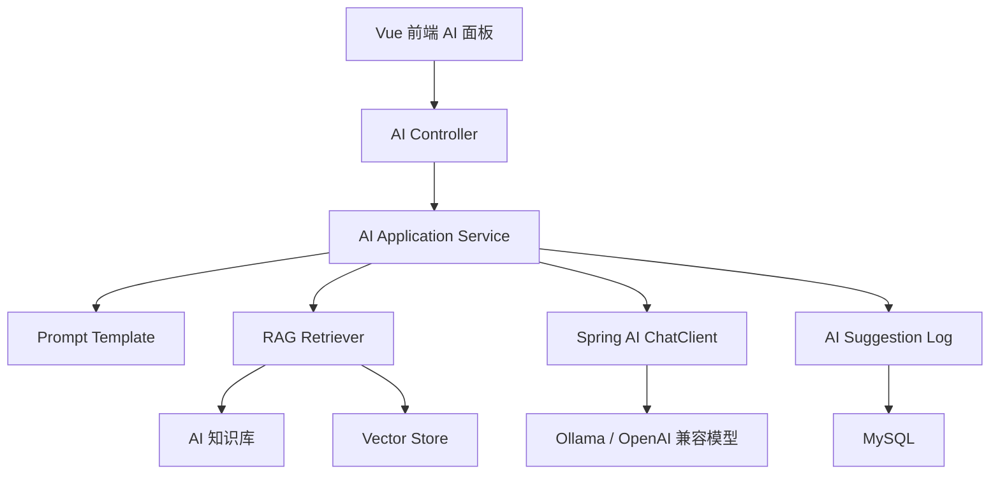

# 在线医疗健康平台 —— Spring AI 智能辅助功能设计

> 文档版本：v1.0  
> 文档日期：2026-04-27  
> 目标：在不替代医生和药剂师决策的前提下，为系统增加轻量人工智能能力。

## 1. AI 模块定位

Spring AI 模块用于提升系统展示亮点和业务体验，主要做“辅助生成、辅助总结、辅助解释、辅助审核”。AI 不能直接给出最终诊断，不能自动开处方，不能自动通过处方审核。

推荐定位：

| 场景 | AI 作用 | 最终责任人 |
|------|---------|------------|
| 问诊聊天 | 生成问诊摘要草稿 | 医生 |
| 电子处方 | 生成通俗版处方说明 | 医生 |
| 药师审核 | 汇总药物风险和注意事项 | 药剂师 |
| 用药提醒 | 生成更自然的提醒文案 | 系统，患者自行确认 |
| 病患跟踪 | 总结健康指标变化趋势 | 医生 |

## 2. 技术选型

| 技术 | 用途 | 说明 |
|------|------|------|
| Spring AI 1.1.4（建议） | AI 接入框架 | 使用 Spring 风格统一调用大模型 |
| ChatClient | 文本生成 | 生成摘要、解释、审核建议 |
| Advisor | 增强调用流程 | 可加入上下文、记忆、RAG 检索 |
| RAG | 检索增强生成 | 从药品说明、相互作用规则、平台文档中检索知识 |
| Ollama | 本地模型服务 | 适合课程演示，避免依赖外部付费 API |
| OpenAI 兼容服务 | 在线模型服务 | 可在部署环境中切换为外部大模型 |
| SimpleVectorStore / Redis Vector Store | 向量检索 | MVP 可先用简单向量存储，后期使用 Redis 或 PGVector |

官方参考：

1. Spring AI Reference: https://docs.spring.io/spring-ai/reference/
2. ChatClient API: https://docs.spring.io/spring-ai/reference/api/chatclient.html
3. Retrieval Augmented Generation: https://docs.spring.io/spring-ai/reference/api/retrieval-augmented-generation.html
4. Ollama Chat: https://docs.spring.io/spring-ai/reference/api/chat/ollama-chat.html

## 3. 总体架构



## 4. AI 功能场景

### 4.1 问诊摘要生成

使用角色：医生  
触发位置：医生聊天窗口、问诊结束页  
输入内容：患者主诉、聊天记录、历史病史摘要、处方信息  
输出内容：主诉、现病史、医生建议摘要、待确认问题  
人工确认：必须由医生确认后写入问诊记录。

输出示例：

```json
{
  "chiefComplaint": "咳嗽 3 天，夜间加重",
  "historySummary": "患者自述无明显发热，曾自行服用感冒药。",
  "doctorSuggestionDraft": "建议结合症状进行用药指导，必要时复诊。",
  "questionsToConfirm": ["是否有药物过敏史", "是否伴随胸闷或呼吸困难"]
}
```

### 4.2 处方通俗解释

使用角色：医生、患者  
触发位置：处方详情页  
输入内容：处方药品、剂量、频次、疗程、注意事项  
输出内容：患者易懂的药品作用、服用方式、注意事项  
人工确认：医生确认后展示给患者。

### 4.3 药师审核辅助

使用角色：药剂师  
触发位置：处方审核台  
输入内容：处方明细、药品说明、相互作用规则、患者过敏史  
输出内容：风险等级、相互作用提示、剂量核对点、审核建议  
人工确认：药剂师必须人工选择通过、驳回或需修改。

### 4.4 用药提醒文案生成

使用角色：患者  
触发位置：用药提醒页  
输入内容：药品名称、用法、频次、时间、饭前饭后要求  
输出内容：自然语言提醒文案  
人工确认：可直接展示，但必须标注“AI 生成，仅供提醒参考”。

### 4.5 健康跟踪解读

使用角色：患者、医生  
触发位置：健康跟踪页、医生患者档案  
输入内容：体温、血压、血糖、症状变化、用药反馈  
输出内容：趋势摘要、异常提示、建议复诊问题  
人工确认：涉及医疗建议时由医生确认。

## 5. RAG 知识库设计

RAG 知识库建议包含：

| 知识类型 | 内容 | 来源 |
|----------|------|------|
| 药品说明 | 药品作用、用法用量、注意事项 | 项目内置模拟数据 |
| 相互作用规则 | 药品组合风险、风险等级、处理建议 | `drug_interaction_rule` |
| 平台流程 | 如何问诊、如何购卡、如何购药 | 项目文档 |
| 常见问题 | 常见症状、慢病管理、用药提醒 | 项目模拟 FAQ |

MVP 实现建议：

1. 第一版先使用本地知识文档和规则表，不强依赖复杂向量数据库。
2. 如果要展示 RAG 亮点，可将药品说明和相互作用规则写入向量库。
3. 检索结果必须随 AI 输出一起保存，便于药剂师或管理员追溯。

## 6. 提示词设计原则

通用系统提示词建议：

```text
你是在线医疗平台的智能辅助助手，只能帮助医生、药剂师或患者整理信息。
你不能替代医生诊断，不能替代药剂师审核，不能直接要求患者自行调整处方药。
输出必须谨慎、清晰、可追溯；如果信息不足，应提示需要医生或药剂师进一步确认。
```

药师审核辅助提示词要求：

1. 必须列出风险等级。
2. 必须说明依据来自处方药品、相互作用规则或知识库。
3. 不允许直接输出“审核通过”作为最终结论。
4. 必须提醒“最终审核由药剂师确认”。

患者展示提示词要求：

1. 避免使用过度确定的医学结论。
2. 使用通俗语言说明用药方式。
3. 对不良反应、过敏、症状加重等场景提示及时复诊。
4. 显示“AI 生成，仅供参考”。

## 7. 数据与审计

每次 AI 调用都需要记录：

| 数据 | 说明 |
|------|------|
| 调用人 | 医生、药剂师、患者或管理员 |
| 业务场景 | 问诊摘要、处方解释、审核辅助、提醒文案 |
| 关联业务 ID | 问诊 ID、处方 ID、提醒 ID |
| 输入摘要 | 脱敏后的输入内容 |
| 输出结果 | AI 返回内容 |
| 引用知识 | RAG 检索到的药品说明或规则 |
| 模型名称 | 使用的模型 |
| 确认状态 | 待确认、已采纳、已拒绝 |

## 8. 安全边界

1. AI 请求前尽量脱敏患者姓名、身份证号、手机号等信息。
2. AI 输出不能自动改写处方，必须经医生确认。
3. AI 输出不能自动通过审核，必须经药剂师确认。
4. 对患者展示的 AI 内容必须明确“仅供参考”。
5. 管理员应能查看 AI 调用日志，便于追溯。
6. 如果模型服务不可用，系统核心问诊、处方、审核、购药流程仍应可用。

## 9. 开发优先级

| 优先级 | 功能 | 说明 |
|--------|------|------|
| P1 | 问诊摘要生成 | 最容易展示 AI 效果，业务风险较低 |
| P1 | 药师审核辅助 | 与药品相互作用规则结合，能体现医疗场景 |
| P1 | 处方通俗解释 | 提升患者端体验 |
| P2 | RAG 知识库 | 可作为答辩亮点 |
| P2 | 健康跟踪解读 | 需要更多健康数据支撑 |
| P2 | AI 调用统计 | 管理后台增强能力 |

## 10. 验收标准

1. 医生可以基于聊天记录生成问诊摘要草稿。
2. 医生可以确认或拒绝 AI 摘要。
3. 药剂师可以查看 AI 审核辅助提示。
4. AI 审核辅助不能直接改变处方状态。
5. 患者可以查看处方通俗解释和提醒文案。
6. AI 调用日志可以查询。
7. 模型不可用时，系统主业务流程不受影响。
