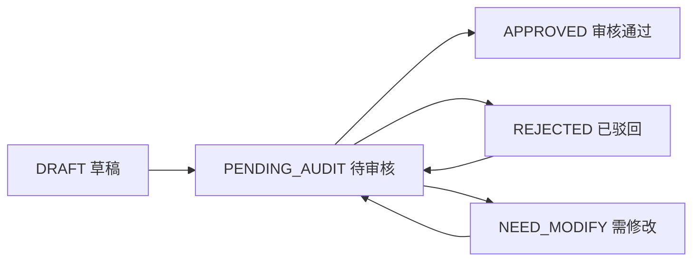

# 第三阶段实施与验收记录

## 1. 阶段目标

第三阶段目标是完成“医生开具电子处方 -> 系统库存与药物相互作用提示 -> 药剂师人工审核 -> 处方状态流转”的核心闭环，为下一阶段医保购药提供前置条件。

## 2. 已实现模块

| 模块 | 实现内容 | 状态 |
| --- | --- | --- |
| 电子处方 | 医生基于问诊会话创建处方草稿，填写诊断、药品、剂量、频次、疗程、用药说明 | 已完成 |
| 处方提交 | 草稿、驳回、需修改状态可重新提交，提交后进入 `PENDING_AUDIT` | 已完成 |
| 处方查询 | 患者查看自己的处方，医生查看自己开具的处方，药剂师查看待审核处方 | 已完成 |
| 库存提示 | 开方和审核时展示库存充足、库存预警、库存不足 | 已完成 |
| 相互作用检查 | 药师审核时根据 `drug_interaction_rule` 匹配处方内药物组合风险 | 已完成 |
| 药师审核 | 药剂师可审核通过、驳回、要求医生修改，并形成审核记录 | 已完成 |
| 前端页面 | 医生开方页、处方列表详情页、药师审核台、聊天窗口开方入口 | 已完成 |
| 演示数据 | 新增第三阶段 SQL，包含权限项、相互作用规则、示例问诊和待审处方 | 已完成 |

## 3. 核心接口

| 方法 | 路径 | 说明 | 角色 |
| --- | --- | --- | --- |
| POST | `/api/doctor/prescriptions` | 创建处方草稿或创建并提交 | 医生 |
| PUT | `/api/doctor/prescriptions/{id}` | 修改处方 | 医生 |
| POST | `/api/doctor/prescriptions/{id}/submit` | 提交处方审核 | 医生 |
| GET | `/api/doctor/prescriptions` | 医生处方列表 | 医生 |
| GET | `/api/patient/prescriptions` | 患者处方列表 | 患者 |
| GET | `/api/prescriptions/{id}` | 处方详情 | 患者、医生、药剂师、管理员 |
| GET | `/api/pharmacist/audits/pending` | 待审核处方列表 | 药剂师 |
| GET | `/api/pharmacist/audits/{prescriptionId}/check` | 自动检查库存和药物相互作用 | 药剂师 |
| POST | `/api/pharmacist/audits/{prescriptionId}` | 提交审核结果 | 药剂师 |

## 4. 状态流转

## 5. 验收结果

| 验收项 | 结果 |
| --- | --- |
| 后端编译 | `mvnw -q -DskipTests compile` 通过 |
| 前端构建 | `npm run build` 通过 |
| 不使用 Spring Security | 符合，仍使用项目已有 JWT 拦截器和 `@RequireRole` |
| MyBatis-Plus 分层 | 符合，实体在 `model/entity`，Mapper 在 `mapper`，Service 接口与实现分离 |

## 6. 后续衔接

第四阶段应基于 `APPROVED` 且未过期的处方创建购药订单，校验医保卡余额、医保目录、库存并完成模拟支付；支付成功后再扣减库存并把处方状态推进到 `PAID`。
