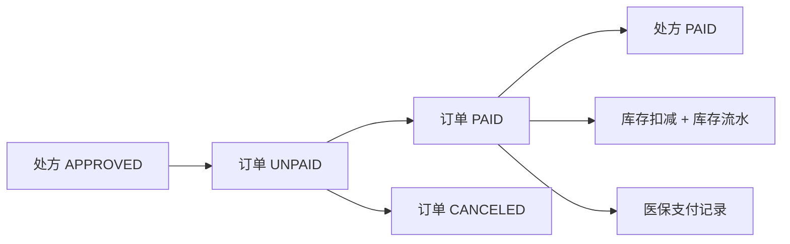

# 第四阶段实施与验收记录

## 1. 阶段目标

第四阶段完成“审核通过处方 -> 生成购药订单 -> 选择医保卡 -> 医保支付 -> 扣减库存 -> 处方已购药”的业务闭环。真实医保接口、真实支付和真实物流均为模拟实现。

## 2. 已实现模块

| 模块 | 实现内容 | 状态 |
| --- | --- | --- |
| 医保卡 | 患者绑定和查看模拟医保卡，包含余额、状态和报销比例 | 已完成 |
| 可购药处方 | 仅展示 `APPROVED`、未过期且未生成有效订单的处方 | 已完成 |
| 购药订单 | 根据审核通过处方生成 `medicine_order` 和明细 | 已完成 |
| 医保目录 | 通过 `insurance_drug_catalog` 计算医保金额和自费金额 | 已完成 |
| 医保支付 | 使用医保卡支付订单，校验余额、状态和归属 | 已完成 |
| 库存扣减 | 支付成功后扣减药品库存并写入 `drug_stock_record` | 已完成 |
| 支付记录 | 支付成功后写入 `insurance_payment_record` | 已完成 |
| 状态流转 | 支付成功后订单变为 `PAID`，处方变为 `PAID` | 已完成 |

## 3. 核心接口

| 方法 | 路径 | 说明 | 角色 |
| --- | --- | --- | --- |
| GET | `/api/patient/insurance-cards` | 查询我的医保卡 | 患者 |
| POST | `/api/patient/insurance-cards` | 绑定模拟医保卡 | 患者 |
| GET | `/api/patient/prescriptions/purchasable` | 查询可购药处方 | 患者 |
| POST | `/api/patient/medicine-orders/from-prescription` | 根据处方创建购药订单 | 患者 |
| GET | `/api/patient/medicine-orders` | 查询我的购药订单 | 患者 |
| GET | `/api/patient/medicine-orders/{id}` | 查看订单详情 | 患者 |
| POST | `/api/patient/medicine-orders/{id}/pay-insurance` | 使用医保卡支付 | 患者 |
| POST | `/api/patient/medicine-orders/{id}/cancel` | 取消未支付订单 | 患者 |

## 4. 状态流转

## 5. 事务规则

医保支付接口在同一个事务内完成：

1. 校验订单属于当前患者且状态为 `UNPAID`。
2. 校验医保卡属于当前患者且状态为 `ACTIVE`。
3. 校验处方仍为 `APPROVED` 且未过期。
4. 校验药品库存仍然充足。
5. 扣减医保卡余额。
6. 扣减药品库存并写库存流水。
7. 更新订单状态为 `PAID`。
8. 更新处方状态为 `PAID`。
9. 写入医保支付记录。

## 6. 验收结果

| 验收项 | 结果 |
| --- | --- |
| 后端编译 | `mvnw -q -DskipTests compile` 通过 |
| 前端构建 | `npm run build` 通过 |
| 不使用 Spring Security | 符合，仍使用项目已有 JWT 拦截器和 `@RequireRole` |
| MyBatis-Plus 分层 | 符合，实体在 `model/entity`，Mapper 在 `mapper`，Service 接口与实现分离 |

## 7. 后续衔接

第五阶段可以在订单支付成功后自动生成用药计划和提醒，并把购药订单、处方明细与病患跟踪记录关联起来。
